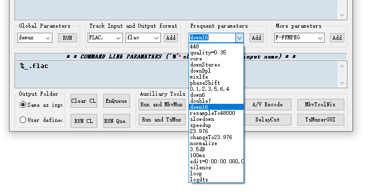

# 2.0/1.0 音轨比较说明
一般来说2.0是存在24bit音轨的，但是如potplayer默认就会转换成16bit输出。并且24bit音轨通常非常大，在flac格式下，接近16bit的两倍(不过存在假24bit音轨)

另外DTS 2.0(core,不是DTS-HD MA 2.0)为有损，24bit的DTS 码率(768kbps) > 16 bit Flac(测试的是448 kb/s) 后者只是某部影片转换的出来的参考值 （实际中不要这么操作，因为这里是有损算法转无损算法，不做down16的情况码率一般会上升）

通常压制2.0/1.0只建议使用Flac,如感觉flac码率过高，可以转为16bit



相反DD/AC3因为压缩效率差，并且因为是固定码率转换，码率给低了效果差，高了很可能比flac还要大(特别是以前有不少AC3 2.0 给640kbps的)

AAC的话，参考下面那些情况，AAC的每条轨道并不建议超过100kbps，200kpbs在某些情况下已经接近flac


以The Asphalt Jungle 1950说明(注意这是1轨道)

原盘

```
1:	English 1.0ch LPCM Audio @ 1152 kbps
```
Remux (24bit FLAC)
```
Audio #1
ID : 2
Format : FLAC
Format/Info : Free Lossless Audio Codec
Codec ID : A_FLAC
Duration : 1 h 52 min
Bit rate mode : Variable
Bit rate : 492 kb/s
Channel(s) : 1 channel
Channel layout : C
Sampling rate : 48.0 kHz
Frame rate : 11.719 FPS (4096 SPF)
Bit depth : 24 bits
Compression mode : Lossless
Stream size : 396 MiB (2%)
Title : FLAC Audio / 1.0 / 48 kHz / 492 kbps / 24-bit
Writing library : libFLAC 1.3.1 (UTC 2014-11-25)
Language : English
Default : Yes
Forced : No
```

Encode(16bit FLAC)
```
General
Complete name               : D:\Seed\The.Asphalt.Jungle.1955.CC.Bluray.1080p.x265.10bit.MNHD-FRDS\The.Asphalt.Jungle.1955.CC.Bluray.1080p.x265.10bit.MNHD-FRDS.mkv_2eng.flac
Format                      : FLAC
Format/Info                 : Free Lossless Audio Codec
File size                   : 160 MiB
Duration                    : 1 h 52 min
Overall bit rate mode       : Variable
Overall bit rate            : 198 kb/s
Track name                  : The Asphalt Jungle
Writing application         : Lavf58.35.102

Audio
Format                      : FLAC
Format/Info                 : Free Lossless Audio Codec
Duration                    : 1 h 52 min
Bit rate mode               : Variable
Bit rate                    : 198 kb/s
Channel(s)                  : 1 channel
Channel layout              : C
Sampling rate               : 48.0 kHz
Bit depth                   : 16 bits
Compression mode            : Lossless
Stream size                 : 160 MiB (100%)
Writing library             : libFLAC 1.2.1 (UTC 2007-09-17)

```


下面是16bit 2.0音轨的码率

以Jin.Bi.Tong.AKA.The.Kid.with.The.Golden.Arm.1979.1080p.Blu-ray.Remux.AVC.DTS-HD.MA.2.0-KRaLiMaRKo举例

```
Audio
ID                          : 2
Format                      : DTS XLL
Format/Info                 : Digital Theater Systems
Commercial name             : DTS-HD Master Audio
Codec ID                    : A_DTS
Duration                    : 1 h 24 min
Bit rate mode               : Variable
Bit rate                    : 632 kb/s
Channel(s)                  : 2 channels
Channel layout              : L R
Sampling rate               : 48.0 kHz
Frame rate                  : 93.750 FPS (512 SPF)
Bit depth                   : 16 bits
Compression mode            : Lossless
Stream size                 : 384 MiB (2%)
Title                       : Mandarin
Language                    : Chinese
Default                     : Yes
Forced                      : No
```

转换为WAV/PCM

(PCM为raw数据，WAV为未经任何压缩的音频格式，PCM因为未封装，故看不到mediainfo信息)
```
General
Complete name               : \Jin.Bi.Tong.AKA.The.Kid.with.The.Golden.Arm.1979.1080p.Blu-ray.Remux.AVC.DTS-HD.MA.2.0-KRaLiMaRKo\Jin.Bi.Tong.AKA.The.Kid.with.The.Golden.Arm.1979.1080p.Blu-ray.Remux.AVC.DTS-HD.MA.2.0-KRaLiMaRKo.mkv_2eng.wav
Format                      : Wave
File size                   : 934 MiB
Duration                    : 1 h 24 min
Overall bit rate mode       : Constant
Overall bit rate            : 1 536 kb/s

Audio
Format                      : PCM
Format settings             : Little / Signed
Codec ID                    : 00000001-0000-0010-8000-00AA00389B71
Duration                    : 1 h 24 min
Bit rate mode               : Constant
Bit rate                    : 1 536 kb/s
Channel(s)                  : 2 channels
Channel layout              : L R
Sampling rate               : 48.0 kHz
Bit depth                   : 16 bits
Stream size                 : 934 MiB (100%)
```

PCM体积933 MB (978,888,704 字节) 与WAV一致

转换为FLAC
```
General
Complete name               : Jin.Bi.Tong.AKA.The.Kid.with.The.Golden.Arm.1979.1080p.Blu-ray.Remux.AVC.DTS-HD.MA.2.0-KRaLiMaRKo\Jin.Bi.Tong.AKA.The.Kid.with.The.Golden.Arm.1979.1080p.Blu-ray.Remux.AVC.DTS-HD.MA.2.0-KRaLiMaRKo.mkv_2chi.flac
Format                      : FLAC
Format/Info                 : Free Lossless Audio Codec
File size                   : 144 MiB
Duration                    : 1 h 24 min
Overall bit rate mode       : Variable
Overall bit rate            : 236 kb/s

Audio
Format                      : FLAC
Format/Info                 : Free Lossless Audio Codec
Duration                    : 1 h 24 min
Bit rate mode               : Variable
Bit rate                    : 236 kb/s
Channel(s)                  : 2 channels
Channel layout              : L R
Sampling rate               : 48.0 kHz
Bit depth                   : 16 bits
Compression mode            : Lossless
Stream size                 : 144 MiB (100%)
Writing library             : libFLAC 1.3.3 (UTC 2019-08-04)
```


用qaac转换 (-V 99)
```
General
Unique ID                   : 181232920087942023197824205628061447959 (0x885830D657BDCC069935FFFCF8CEF717)
Complete name               : Jin.Bi.Tong.AKA.The.Kid.with.The.Golden.Arm.1979.1080p.Blu-ray.Remux.AVC.DTS-HD.MA.2.0-KRaLiMaRKo.mkv_2eng.mka
Format                      : Matroska
Format version              : Version 4
File size                   : 55.8 MiB
Duration                    : 1 h 24 min
Overall bit rate            : 91.8 kb/s
Encoded date                : UTC 2022-01-06 06:36:30
Writing application         : mkvmerge v63.0.0 ('Everything') 64-bit
Writing library             : libebml v1.4.2 + libmatroska v1.6.4

Audio
ID                          : 1
Format                      : AAC LC
Format/Info                 : Advanced Audio Codec Low Complexity
Codec ID                    : A_AAC-2
Duration                    : 1 h 24 min
Bit rate                    : 90.5 kb/s
Channel(s)                  : 2 channels
Channel layout              : L R
Sampling rate               : 48.0 kHz
Frame rate                  : 46.875 FPS (1024 SPF)
Compression mode            : Lossy
Stream size                 : 55.0 MiB (99%)
Language                    : Armenian
Default                     : Yes
Forced                      : No


```